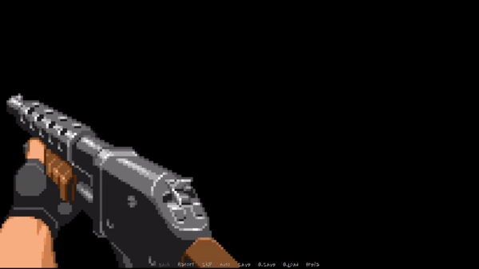

# RenPy-Weapon-Displayable

A custom displayable for the Ren'Py Visual Novel Engine that provides an easy way to incorporate weapons and their associated animations and sound effects into your game. Perfect for adding interactivity and enhancing immersion in your visual novel projects.

<p align="center">
  
</p>

## Features
- Custom displayable that allows for different weapon states
- Easy to integrate shooting and reloading animations with sound effects
- State sharing capability across different screens
- Customizable according to specific weapon characteristics

## Usage
Simply create an instance of the `Weapon` class, specifying the displayables for the static, shooting, and reloading states of the weapon, along with sound effects.

Example:
```python
screen gun_screen:
    add Weapon(
        static_displayable="shotgun.png", 
        shooting_displayables=["shotgun_shooting.png"], 
        reloading_displayables=["shotgun_reloading1.png","shotgun_reloading2.png", "shotgun_reloading3.png", "shotgun_reloading4.png"], 
        shooting_sfx="<from 3.7 to 5.3>sfx_shotgun.opus", 
        reloading_sfx="<from 1.7 to 2.6>sfx_shotgun.opus"
        reloading_state=False # Can be useful to prevent damage to enemies during reload.
        shooting_state=False # Can be useful to deal damage to enemies.
        )
```

## Installation

To install the `Weapon` class for use in your Ren'Py game, simply copy the `weapon.rpy` file into the `/game` directory of your project.

Here's the file structure you should have:

```
/game
├── weapon.rpy
├── script.rpy
└── options.rpy
```

## Contribution

Contributions are welcomed! If you find a bug or have a feature suggestion, please open an issue to discuss.

## License

This project is under the MIT license.

